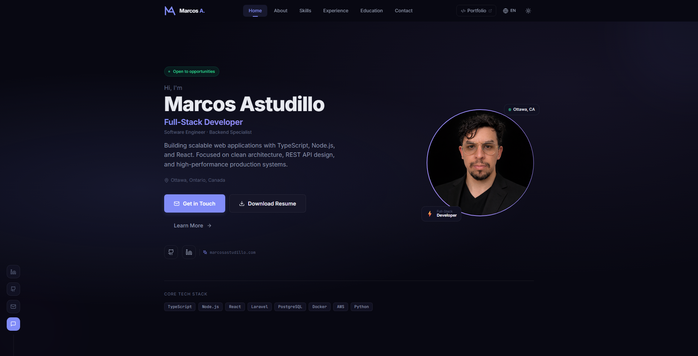

# Marcos Astudillo — Personal Portfolio

<p align="center">

[](https://www.marcosastudillo.com)
[](https://github.com/marcos-astudillo/webpage-portfolio)


</p>

Professional portfolio website for **https://www.marcosastudillo.com**.

Built with **Vite + React + TypeScript + Tailwind CSS**.  
The project outputs a **static build** that can be deployed on almost any hosting provider, including **HostGator shared hosting**.

---

## 🌐 Live Demo

👉 https://www.marcosastudillo.com

---

## Preview



---

## Features

- 🌙 Dark / Light theme toggle
- 🌎 English / Spanish language switch
- 📱 Fully responsive design
- 🧩 Modular component architecture
- 📂 Reusable portfolio system
- 📨 Contact form with captcha protection
- ⚡ Fast static build using Vite
- 🧱 Clean project structure designed for reuse

---

## Architecture

The project follows a **modular and reusable architecture** designed for maintainability and scalability.

Key design principles:

- Component-based UI architecture
- Section-based page organization
- Context providers for theme and language
- Static data separated from UI components
- Reusable portfolio structure
- CI/CD deployment pipeline

---

## Tech Stack

| Layer           | Technology                             |
| --------------- | -------------------------------------- |
| Framework       | React 18 + TypeScript                  |
| Build Tool      | Vite 5                                 |
| Styling         | Tailwind CSS 3 + CSS Custom Properties |
| Routing         | React Router v6                        |
| Animations      | Framer Motion                          |
| Icons           | Lucide React                           |
| i18n            | Custom lightweight context (EN/ES)     |
| Contact Backend | PHP (`public/form-handler.php`)        |
| Deployment      | HostGator Shared Hosting (FTP upload)  |

---

## Getting Started

Install dependencies

```bash
npm install
```

Run development server

```bash
npm run dev
```

Build production bundle

```bash
npm run build
```

Preview production build

```bash
npm run preview
```

---

## Project Structure

```
webpage-portfolio/
├── public/
│   ├── assets/
│   │   ├── images/
│   │   │   ├── profile.png
│   │   │   └── webpage.png
│   │   └── resume/
│   │       ├── marcos-astudillo-resume-en.pdf
│   │       └── marcos-astudillo-resume-es.pdf
│   ├── .htaccess
│   ├── form-handler.php
│   └── favicon.svg
├── src/
│   ├── components/
│   │   ├── ui/
│   │   ├── layout/
│   │   └── sections/
│   ├── pages/
│   ├── context/
│   ├── i18n/
│   ├── data/
│   ├── config/
│   └── styles/
├── index.html
├── vite.config.ts
└── tailwind.config.ts
```

---

## Customization

### Portfolio Mode

Edit:

```
src/config/site.ts
```

Example:

```ts
export const PORTFOLIO_MODE: "coming-soon" | "projects" = "coming-soon";
```

When projects are ready:

```ts
export const PORTFOLIO_MODE: "coming-soon" | "projects" = "projects";
```

---

### Add Projects

Edit:

```
src/data/projects.ts
```

Add new entries to the `projects` array.

---

### Add or Update Translations

Translation files are located in:

```
src/i18n/
```

Steps:

1. Create a new translation file.
2. Implement the `Translations` interface from `src/i18n/types.ts`.
3. Register the language in `src/context/LanguageContext.tsx`.
4. Add the language option to the language switcher in `src/components/layout/Header.tsx`.

---

### Update Resume Files

Replace the files in:

```
public/assets/resume/
```

- marcos-astudillo-resume-en.pdf
- marcos-astudillo-resume-es.pdf

---

### Update Profile Image

Replace:

```
public/assets/images/profile.png
```

---

## Deployment (HostGator)

Build the project:

```bash
npm run build
```

The compiled output will be generated in:

```
dist/
```

Upload **all files inside `dist/`** to:

```
public_html/
```

Also upload:

```
public/form-handler.php
```

Ensure `.htaccess` is included and update the recipient email inside `form-handler.php`.

---

## Git Workflow

Typical development workflow:

```bash
git checkout -b feat/feature-name
git add .
git commit -m "feat: describe your change"
git push origin feat/feature-name
```

After merge:

```bash
git checkout main
git pull origin main
```

### Commit Convention

- feat — new feature
- fix — bug fix
- docs — documentation
- refactor — code restructuring
- style — visual changes
- chore — tooling or configuration
- content — text or data updates

---

## License

This project is licensed under the MIT License.

See the LICENSE file for details.

---

## 📫 Connect With Me

<p align="center">

<a href="https://www.marcosastudillo.com">

</a>

<a href="https://www.linkedin.com/in/marcos-astudillo-c/">

</a>

<a href="https://github.com/marcos-astudillo">

</a>

<a href="mailto:m.astudillo1986@gmail.com">

</a>

</p>
